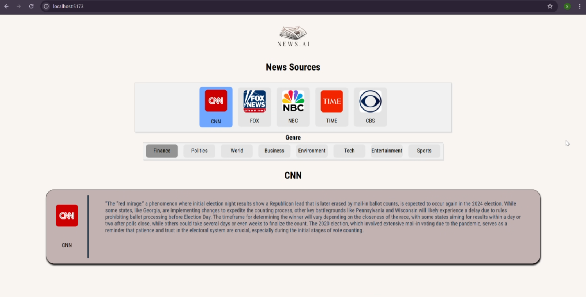
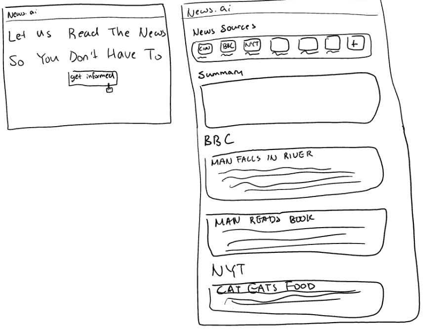
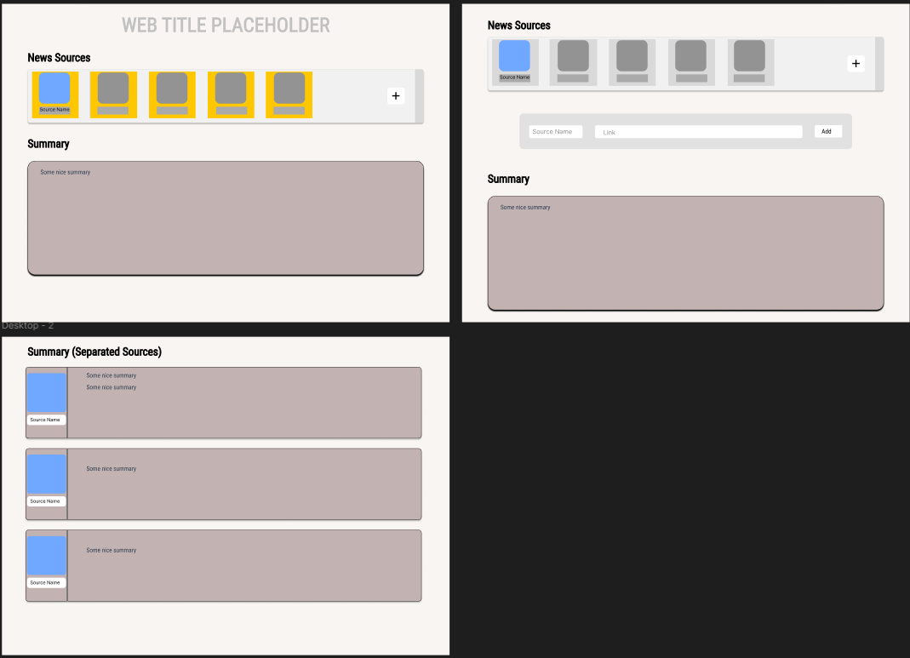

# news.ai

## Cover Image

## Tagline
Let us read the news, so you don't have to!

## Problem It Solves
news.ai mitigates the inaccessibility of news and lowers the effort-barrier to accessing worldwide information using AI (Gemini LLM). It allows users to effortlessly stay up-to-date on global events by summarizing news articles from various sources.

## Challenges We Ran Into
One of the main challenges was developing methods for web scraping from different news sources. To tackle this, we had to create custom web scrapers for each news source to handle varying HTML structures and dynamic content.

## Technologies Used
- Python
- Gemini LLM
- Flask
- BeautifulSoup
- GitHub
- HTML/CSS

## Video Demo
[Watch the video demo](https://your-video-link.com)

## Sketch

## Figma Mock Design

## Limitations
Due to a time zone misunderstanding, we only had 12 hours to work on this project instead of the 36 hours we could have had, as we initially thought the deadline was in EST instead of IST. Additionally, we faced challenges connecting the backend to the frontend, which impacted our development process.

